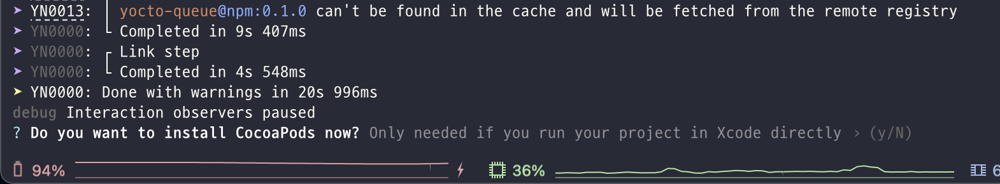
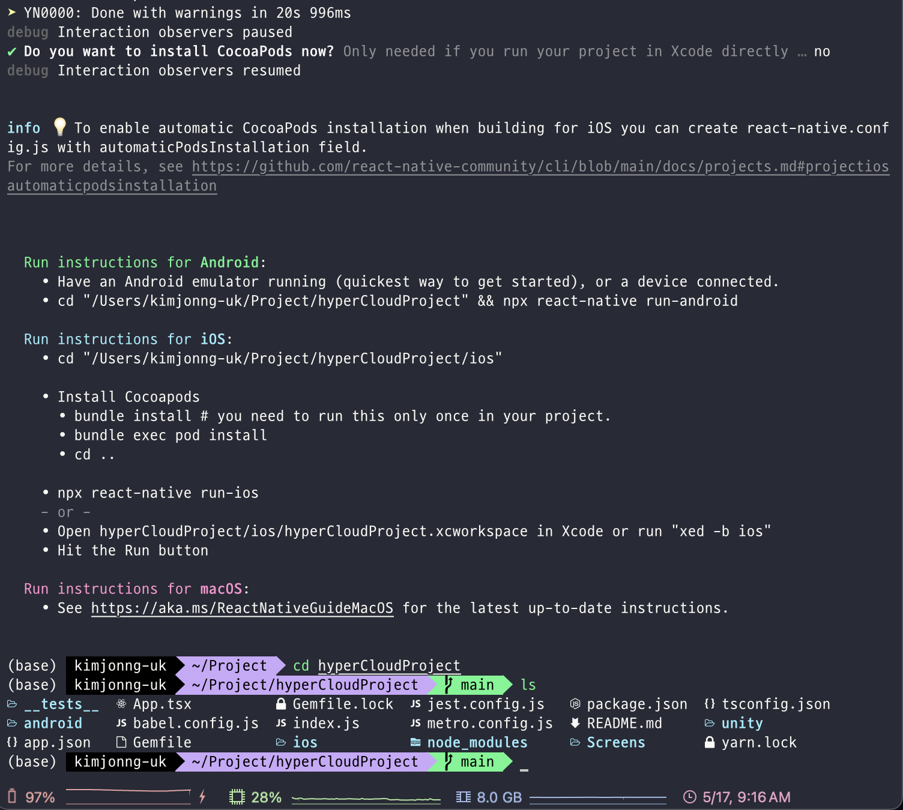
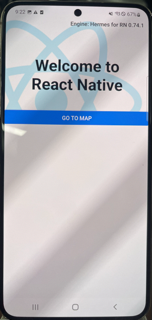
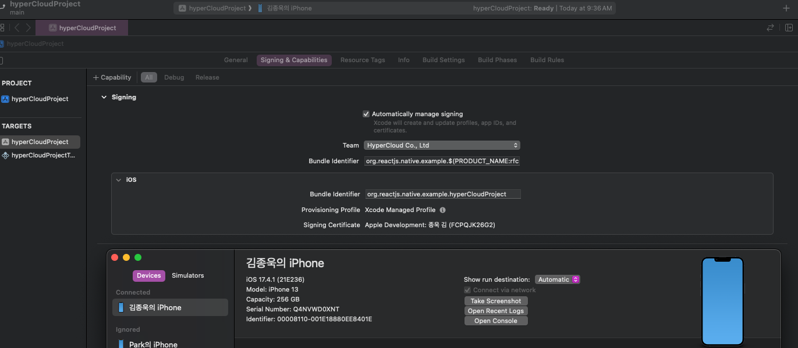
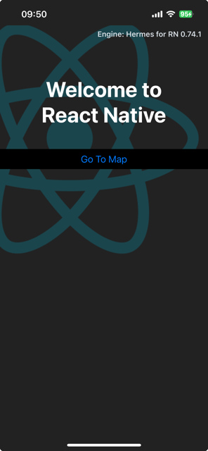
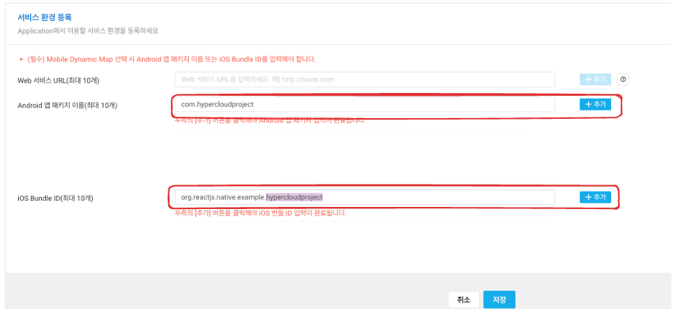

Hyper Cloud 에서 제공하는 React Native + Unity Template 입니다.

# Getting Started

## Version Management

- Mac
  - MacBook Pro 14
  - Apple M1 Pro
  - Sonama
- React Naitve Libraray
  - React Naitve version: 0.74.1
  - @azesmway/react-native-unity: 1.0.9
- Android
  - JAVA version jbr-17
  - Android Studio Hedgehog | 2023.1.1 Patch 2
  - distributionUrl=https\://services.gradle.org/distributions/gradle-8.3-all.zip
  - ndk 21.3.6528147
- iOS
  - Xcode Version 15.2 (15C500b)
  - IOS OS Target version 13.4
- Unity
  - Unity version 2021.3.12.f1
  - Package
    - arcore : 4.2.8
    - arkit : 4.2.8
    - arfoundation : 4.2.8
    - urp : 12.1.7

---

## Step 1: npx 로 react-native Project 생성하기

### Android

기본적으로 위의 RN 빌드 환경이 설정되었다는 가정하에 작성된 문서 입니다.

npx 로 0.74.1 version RN 프로젝트를 생성 합니다. (가명: hyperCloudProject)
이때 _--template_ flag 에 RNTemplate.git 주소를 추가합니다.

```bash
# using npx
npx react-native@0.74.1 init hyperCloudProject --template https://github.com/hypercloud-kr/RNTemplate.git --verbose
```

설치 중간에 CocoaPods 설치를 권유하면 우선 거부한다. (N)



설치에 성공했다면 프로젝트가 아래 사진처럼 생성된다.



디바이스를 연결하고 yarn android 를 실행 한다.

```bash
yarn android
```

기존에 React native 초기 화면과 다른 template 으로 커스텀된 MainView 를 볼수 있다. 또한 카메라, 위치에 대한 권한을 요청 한다.
(후에 메인 화면 작업예정)


### iOS

프로젝트 경로에서 pods 를 설치 한다

```bash
# using npm
cd ios && pod install && cd ..
```

> 주의!!! XCode 디바이스 등록 및 Signing & Capabilities 등 기본적인 iOS 빌드 환경 셋팅 작업을 완료하고 시도해 보길 바란다.
>
> 

```bash
# using Yarn
yarn ios
```

iOS 또한 카메라, 위치 권한 요청과 커스텀된 MainView 를 볼수있다.



## Step 2: NaverMap 설정하기

지도를 활용한 컨텐츠는 대부분의 경우에 필요하기 때문에 NaverMap 을 템플릿에 추가 하였다. 기본적인 Native 설정 및 권한 그리고 React Native Code 는 Template 에 작성되어 프로젝트에 포함되어 있다. 추가적으로 확인이 필요한 사항은 아래와 같다.

1.  NaverMap CLIENT_ID 설정 (현재 naver 계정 이슈로 donald 개인계정 CLIENT_ID 사용 중)
2.  NaverCloud 에서 앱 ID 추가하기

XR 팀 대표 계정으로 발급 받은 CLIENT_ID 로 설정되어 있는 것을 확인 할수 있다. 추후에 변경이 필요하다면 아래 내용을 수정 한다.

### Android

```xml
<!-- AndroidManifest.xml -->
<meta-data
  android:name="com.naver.maps.map.CLIENT_ID"
  android:value="92ta6poq6p" />
```

NaverCloud 에 applicationId 를 추가한다.

```gradle
// root/android/app/build.gradle
android {
    ...
    defaultConfig {
        applicationId "com.hypercloudproject"
        ...
    }
}
```

### iOS

```plist
<!-- Info.plist -->
...
<key>NMFClientId</key>
<string>92ta6poq6p</string>
...
```

NaverCloud 에 iOS Bundle ID 를 추가한다.

`PRODUCT_BUNDLE_IDENTIFIER = "org.reactjs.native.example.hypercloudproject`

### Naver Cloud Console



추가, 저장 후에 MainView 의 "GO TO MAP" 버튼을 클릭하여 네이버 지도가 정상적으로 렌더 되는지 확인 한다.

## Step 3: Unity 설정하기

생성 된 unity/builds 폴더의 android, ios 폴더에 각각 Project 와 Framework 파일을 추가 해준다.
상세한 내용 및 파일 추출 방법은 아래의 문서로 대체한다.

### [VPS_Mock-up_RN Unity 빌드 셋팅하기](https://github.com/hypercloud-kr/vps-RN-front/blob/main/README.md)

### Android

1. `unity/android/builds/android` 경로에 unityLibrary 폴더를 추가 한다.
2. unity 연동을 위한 React native 라이브버리를 추가 한다.

```bash
yarn add @azesmway/react-native-unity
```

3. 프로젝트 내에서 "FIXME" 키워드로 검색하여 Unity 연동과 관련된 코드 주석을 해제하고 가이드 내용 삭제 한다.
4. gradlew 초기화 한다.

```bash
cd android && ./gradlew clean && cd ..
```

5. 실행, 첫 빌드는 다소 시간이 소요된다. (95% 쯤에서 3-4분 정도)

```bash
yarn android
```

### iOS

---

### Template 추가된 패키지 목록

- @mj-studio/js-util": "^1.0.34",
- @mj-studio/react-native-naver-map": "^1.5.6",
- @react-navigation/native": "^6.1.17",
- @react-navigation/native-stack": "^6.9.26",
- @react-navigation/stack": "^6.3.29",
- react-native-gesture-handler": "^2.16.0",
- react-native-permissions": "^4.1.5",
- react-native-safe-area-context": "^4.9.0",
- react-native-screens": "^3.30.1"

# Troubleshooting

- npx ... --template 설치 실패하는 에러
  - 간헐적으로 발생하기 때문에 이유를 찾기 힘들었다. 왜 실패했는지에 대한 상세로그가 없어서 트래킹 하기 힘들었다.
  - npx … —varbose 옵션을 추가하면 에러 내용을 볼수있었는데 yarn 을 설치할때 뭔가 에러가 있다는 메세지
  - `Caches` 문제 인거 같아 아래 cmd 로 캐시를 삭제하고 다시 npx 하였더니 해결되었다.
  - `rm -rf /Users/{로컬경로}/Library/Caches/Yarn/v6/.tmp/{캐시값}` (정확한 값은 --verbose 옵션으로 확인 가능하다)
